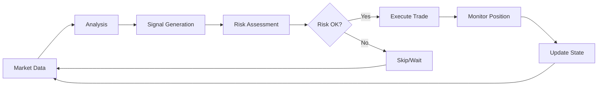

# Dyadix Bot - LangGraph Edition

## 🚀 Overview

**Dyadix Bot** adalah trading bot cerdas yang dibangun dengan **LangGraph** untuk manajemen state dan workflow yang canggih. Bot ini dirancang untuk trading cryptocurrency otomatis dengan pendekatan multi-agent yang terstruktur.

## ✨ Fitur Utama

- 🧠 **Multi-Agent Architecture**: Analyzer, Risk Manager, dan Trader bekerja sama
- 📊 **State Management**: Centralized state dengan LangGraph
- ⚡ **Real-time Trading**: Monitoring pasar dan eksekusi otomatis
- 🛡️ **Risk Management**: Proteksi modal dengan stop-loss dinamis
- 📈 **Performance Tracking**: Monitoring profit/loss dan metrics
- 🔄 **Error Recovery**: Automatic recovery dari error

## 🏗️ Arsitektur

```
┌─────────────────┐    ┌─────────────────┐    ┌─────────────────┐
│  Market Analyzer│    │   Risk Manager  │    │     Trader      │
│                 │    │                 │    │                 │
│ • Data Collection│    │ • Risk Assessment│   │ • Order Execution│
│ • Signal Generation│   │ • Position Sizing│   │ • Portfolio Mgmt │
│ • Trend Analysis│    │ • Stop Loss      │    │ • Trade Tracking │
└─────────────────┘    └─────────────────┘    └─────────────────┘
         │                       │                       │
         └───────────────────────┼───────────────────────┘
                                 │
                    ┌─────────────────┐
                    │  LangGraph      │
                    │  State Manager  │
                    │                 │
                    │ • Trading State │
                    │ • Workflow Mgmt │
                    │ • Error Handling│
                    └─────────────────┘
```

## 🚦 Quick Start

### 1. Installation

```bash
# Clone repository
git clone <repo-url>
cd dyadix

# Install dependencies
pip install -r requirements.txt

# Install LangGraph
pip install langgraph langchain-core
```

### 2. Configuration

```bash
# Copy environment template
cp .env.example .env

# Edit dengan API keys Anda
BINANCE_API_KEY=your_binance_api_key
BINANCE_SECRET_KEY=your_binance_secret_key
TELEGRAM_BOT_TOKEN=your_telegram_token
TELEGRAM_CHAT_ID=your_chat_id
```

### 3. Run Bot

```bash
# Development mode
python main.py --mode dev

# Production mode
python main.py --mode prod

# Paper trading (recommended untuk testing)
python main.py --mode paper
```

## 📋 Workflow



## 🎯 Trading Strategy

### Signals
- **RSI**: Overbought/Oversold detection
- **MACD**: Trend confirmation
- **Bollinger Bands**: Volatility analysis
- **Volume**: Market strength validation

### Risk Management
- **Position Sizing**: Kelly Criterion based
- **Stop Loss**: ATR-based dynamic stops
- **Take Profit**: Risk/Reward ratio 1:2
- **Max Drawdown**: 10% portfolio protection

## 📊 State Schema

```python
class TradingState(TypedDict):
    # Market Data
    market_data: Dict[str, Any]
    signals: List[Signal]
    
    # Positions
    positions: List[Position]
    orders: List[Order]
    balance: float
    
    # Risk Metrics
    risk_metrics: RiskMetrics
    max_drawdown: float
    
    # System Status
    last_update: datetime
    errors: List[str]
    status: SystemStatus
```

## 🔧 Configuration

### Trading Parameters
```python
TRADING_CONFIG = {
    'symbols': ['BTCUSDT', 'ETHUSDT'],
    'timeframes': ['1h', '4h'],
    'max_positions': 3,
    'risk_per_trade': 0.02,  # 2% per trade
    'stop_loss': 0.015,      # 1.5%
    'take_profit': 0.03      # 3%
}
```

### Agent Settings
```python
AGENT_CONFIG = {
    'market_analyzer': {
        'update_interval': 300,  # 5 minutes
        'indicators': ['rsi', 'macd', 'bb']
    },
    'risk_manager': {
        'max_risk': 0.10,        # 10% portfolio
        'correlation_limit': 0.7
    },
    'trader': {
        'slippage_tolerance': 0.001,  # 0.1%
        'retry_attempts': 3
    }
}
```

## 📈 Monitoring

### Telegram Notifications
- Trade executions
- P&L updates
- Error alerts
- Daily summaries

### Logging
```python
# Structured logging dengan LangSmith
import logging
logging.basicConfig(
    level=logging.INFO,
    format='%(asctime)s - %(name)s - %(levelname)s - %(message)s'
)
```

## 🧪 Testing

```bash
# Run all tests
python -m pytest tests/

# Specific test suite
python -m pytest tests/test_agents.py

# With coverage
python -m pytest --cov=src tests/
```

## 📁 Project Structure

```
dyadix/
├── src/
│   ├── agents/              # Multi-agent components
│   │   ├── market_analyzer.py
│   │   ├── risk_manager.py
│   │   └── trader.py
│   ├── nodes/               # LangGraph nodes
│   │   ├── data_collection.py
│   │   ├── signal_generation.py
│   │   └── execution.py
│   ├── state/               # State management
│   │   ├── trading_state.py
│   │   └── schemas.py
│   ├── workflows/           # LangGraph workflows
│   │   ├── main_workflow.py
│   │   └── recovery_workflow.py
│   └── utils/               # Utilities
│       ├── binance_client.py
│       ├── indicators.py
│       └── notifications.py
├── tests/                   # Test suite
├── config/                  # Configuration files
├── logs/                    # Log files
└── docs/                    # Documentation
```

## 🚨 Safety Features

### Circuit Breakers
- Maximum daily loss limit
- Position size limits
- API rate limiting
- Error threshold monitoring

### Risk Controls
- Pre-trade validation
- Position correlation checks
- Market condition filters
- Emergency stop mechanism

## 📚 Documentation

- [Migration Guide](./LANGGRAPH_MIGRATION.md) - Detailed migration plan
- [API Documentation](./docs/api.md) - API reference
- [Architecture Guide](./docs/architecture.md) - System architecture
- [Trading Strategy](./docs/strategy.md) - Strategy details

## 🤝 Contributing

1. Fork the repository
2. Create feature branch: `git checkout -b feature/new-feature`
3. Commit changes: `git commit -am 'Add new feature'`
4. Push branch: `git push origin feature/new-feature`
5. Submit pull request

## 📄 License

MIT License - see [LICENSE](LICENSE) file for details.

## ⚠️ Disclaimer

**Trading cryptocurrencies involves substantial risk of loss. Use this bot at your own risk. Past performance does not guarantee future results. Only trade with money you can afford to lose.**

---

## 🔗 Links

- [LangGraph Documentation](https://python.langchain.com/docs/langgraph)
- [Binance API](https://binance-docs.github.io/apidocs/)
- [Technical Analysis Library](https://technical-analysis-library-in-python.readthedocs.io/)

## 📞 Support

- Create an [Issue](../../issues) for bugs
- Join our [Telegram Group](https://t.me/dyadix_bot) for discussions
- Email: support@dyadix.com