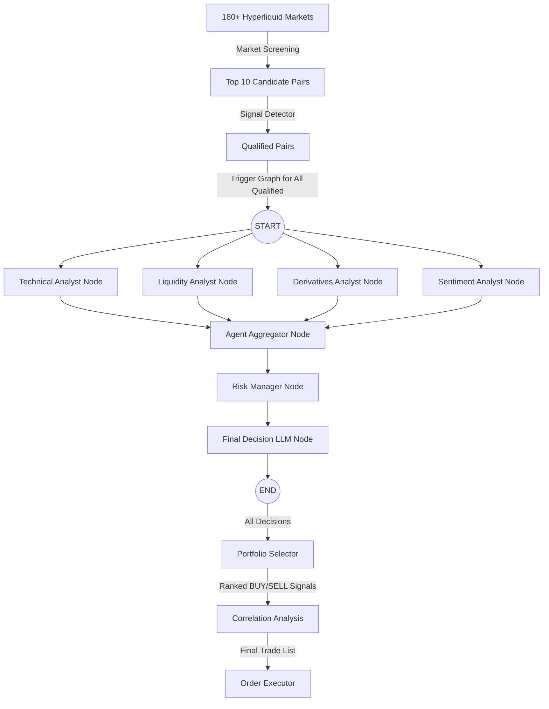

# Dyadix Trading Bot - LangGraph Workflow Documentation

Dokumen ini menjelaskan secara rinci perubahan arsitektur **Dyadix Bot** dari model pipeline linear tradisional menjadi **Orchestrator AI Multi-Agent berbasis LangGraph** menggunakan **Opsi B (Hybrid: Rule-Based Analyst + LLM Coordinator)**.

---

## 🏗️ High-Level Architecture

Arsitektur baru memisahkan proses berat (Market Screening dan Signal Detection) di luar grafik LangGraph sebagai pre-processing layer yang deterministik. LangGraph hanya dijalankan untuk trade validation ketika suatu pair telah lolos pre-filter ini.



---

## 🧠 State Schema (DyadixState)

State utama didefinisikan dalam `workflows/state.py` menggunakan `TypedDict` untuk menampung seluruh inputs, outputs, dan verdicts antar agen selama siklus eksekusi grafik:

```python
from typing import TypedDict, Dict, Any, List

class DyadixState(TypedDict):
    # Core Metadata
    symbol: str
    realtime_price: float
    current_market_session: str
    
    # Input Context Data
    market_data: Dict[str, Any]            # Data teknikal dari ContextBuilder
    sentiment_data: Dict[str, Any]         # Data sentimen global (news, social, F&G)
    derivatives_data: Dict[str, Any]       # Data derivatif per pair (funding, OI)
    liquidity_data: Dict[str, Any]         # Data likuiditas (sweep & pool proximity)
    correlation_data: Dict[str, Any]       # Data korelasi benchmark BTC
    microstructure_data: Dict[str, Any]    # Data microstructure (CVD, whale orderbook)
    signal_detector_result: Dict[str, Any] # Skor inisiasi dari Signal Detector
    
    # Analyst Agent Verdicts
    technical_verdict: Dict[str, Any]
    liquidity_verdict: Dict[str, Any]
    derivatives_verdict: Dict[str, Any]
    sentiment_verdict: Dict[str, Any]
    
    # Consolidations & Risk
    aggregated_verdict: Dict[str, Any]
    risk_verdict: Dict[str, Any]
    
    # Final Decision Output
    final_decision: Dict[str, Any]
    
    # Error tracking
    errors: List[str]
```

---

## ⚙️ Detail Node & Agent

### 1. Parallel Analyst Nodes (Rule-Based)
Untuk meminimalkan biaya token LLM dan mengoptimalkan latensi, 4 node analis pertama berjalan secara **paralel** menggunakan fungsi Python deterministik:

*   **Technical Analyst Node** (`workflows/nodes/technical_analyst.py`):
    *   *Tugas:* Menganalisis daily bias, trend regime (EMA), RSI momentum, dan candlestick patterns (engulfing/hammer).
    *   *Output:* Bias (Bullish/Bearish/Neutral), confidence score, dan pendukung teknikal.
*   **Liquidity Analyst Node** (`workflows/nodes/liquidity_analyst.py`):
    *   *Tugas:* Mendeteksi PDH/PDL sweeps, support/resistance pools, dan status likuiditas.
    *   *Output:* Bias likuiditas, confidence score, dan level likuiditas relevan.
*   **Derivatives Analyst Node** (`workflows/nodes/derivatives_analyst.py`):
    *   *Tugas:* Menganalisis trend funding rate dan perubahan Open Interest (OI).
    *   *Output:* Bias positioning futures (Longs/Shorts increasing) dan tingkat keyakinan.
*   **Sentiment Analyst Node** (`workflows/nodes/sentiment_analyst.py`):
    *   *Tugas:* Menganalisis Fear & Greed index, event ekonomi high-impact, serta berita makro.
    *   *Output:* Bias sentimen global dan skor sentimen numerik.

### 2. Consolidator Nodes
Setelah node analis selesai berjalan secara paralel, grafik menyatukan (join) state-nya menuju:

*   **Agent Aggregator Node** (`workflows/nodes/agent_aggregator.py`):
    *   *Tugas:* Menggabungkan verdict dari 4 analis menggunakan model *weighted consensus* (Technical: 40%, Sentiment: 30%, Derivatives: 20%, Liquidity: 10%).
    *   *Output:* `consensus_bias`, `consensus_score`, `consensus_confidence`, serta gabungan alasan terformat.
*   **Risk Manager Node** (`workflows/nodes/risk_manager.py`):
    *   *Tugas:* Menentukan parameter risiko entry. Jika consensus bias valid (Bullish/Bearish), Risk Manager menghitung dynamic Stop Loss (entry ± 2 * ATR) dan Target Take Profit (min. Risk/Reward 1:3.0).
    *   *Output:* status `cleared` (True/False), stop_loss price, take_profit price, dan leverage.

### 3. Final Decision Node (LLM Coordinator)
*   **Final Decision Node** (`workflows/nodes/final_decision.py`):
    *   *Tugas:* Menerima hasil agregasi dan parameter risiko. Jika `cleared` bernilai `False`, node langsung mengembalikan keputusan `WAIT`. Jika `True`, node memanggil **Decision LLM** dengan JSON Schema ketat untuk merumuskan koordinat order final (BUY/SELL, Entry Zone, Target, Stop Loss, Invalidated If, dan Key Risks).

---

## 🔄 Alur Integrasi Pipeline

Alur integrasi diimplementasikan pada `pipelines/main_pipeline.py` dan `pipelines/loop_scheduler.py` sebagai berikut:

1.  **Staggered Data Fetching:** `DataManager` menyegarkan cache data pasar (OHLCV, Funding, OI, Sentiment) yang sudah stale secara staggered.
2.  **Screening & Pre-filtering:** `ScreeningService` memperbarui Top 10 Candidate secara dinamis (tanpa hardcode pair di settings). `SignalDetector` melakukan scoring confluence.
3.  **Graph Execution (All Decisions):** Seluruh pair yang lolos pre-filter (Qualified Pairs) akan dieksekusi secara independen di LangGraph untuk menghasilkan keputusan trading final (`BUY`, `SELL`, `WAIT`, `HOLD`):
    ```python
    from workflows.trading_workflow import create_trading_workflow
    
    workflow = create_trading_workflow()
    workflow_result = workflow.invoke(initial_state)
    decision = workflow_result.get("final_decision", {})
    ```
4.  **Portfolio Selection & Correlation Analysis:**
    *   **Portfolio Selector:** Menyaring semua keputusan yang menghasilkan tindakan aktif (`BUY` / `SELL`) dan mengurutkannya berdasarkan nilai `confidence` sinyal (tertinggi ke terendah).
    *   **Correlation Filter:** Menggunakan data korelasi historis (`correlation_data["matrix"]`), sistem membandingkan korelasi secara berpasangan (*pairwise*). Jika korelasi antar kandidat melanggar batas (`abs(corr) > 0.7`), koin dengan prioritas lebih rendah akan dibuang/dilewati guna menghindari over-exposure.
    *   **Final Trade List:** Daftar final yang aman dibatasi hingga kapasitas maksimal (`max_tradeable`).
5.  **Order Placement:** `OrderExecutor` hanya mengeksekusi order market/limit beserta stop-loss & take-profit order di Hyperliquid untuk koin-koin yang masuk dalam **Final Trade List**. Koin yang tereliminasi oleh filter portofolio/korelasi akan di-downgrade keputusannya menjadi `WAIT`.

---

## 🧪 Verifikasi & Pengujian

*   **Unit Tests:** [test/test_langgraph_workflow.py](file:///d:/Project/Python/Bot/dyadix/test/test_langgraph_workflow.py) menguji logika kalkulasi node teknikal, likuiditas, derivatif, serta fungsionalitas kompilasi grafik StateGraph secara lokal.
*   **Live Integration Test:** [scratch/test_live_langgraph_integration.py](file:///d:/Project/Python/Bot/dyadix/scratch/test_live_langgraph_integration.py) menguji seluruh siklus workflow secara live dari pengambilan data market asli hingga pemanggilan Decision LLM.
