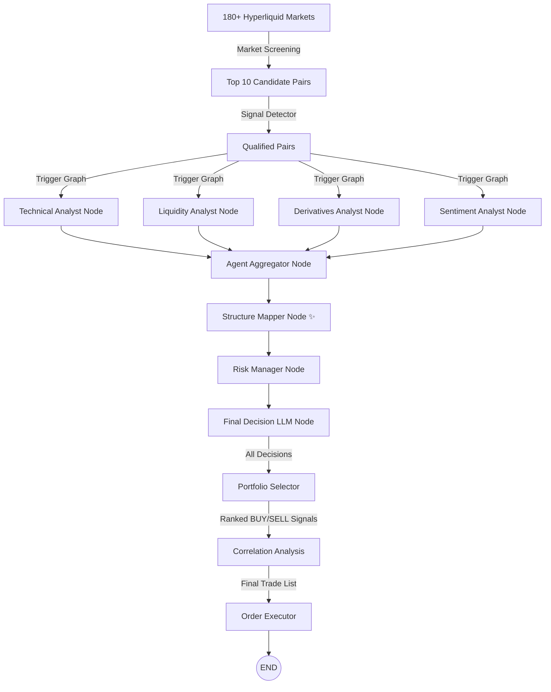

# Dyadix Trading Bot - LangGraph Workflow Documentation

Dokumen ini menjelaskan secara rinci perubahan arsitektur **Dyadix Bot** dari model pipeline linear tradisional menjadi **Orchestrator AI Multi-Agent berbasis LangGraph** menggunakan **Opsi B (Hybrid: Rule-Based Analyst + LLM Coordinator)**.

---

## 🏗️ High-Level Architecture

Arsitektur baru memisahkan proses berat (Market Screening dan Signal Detection) di luar grafik LangGraph sebagai pre-processing layer yang deterministik. LangGraph hanya dijalankan untuk trade validation ketika suatu pair telah lolos pre-filter ini.



---

## 🧠 State Schema (DyadixState)

State utama didefinisikan dalam `workflows/state.py` menggunakan `TypedDict` untuk menampung seluruh inputs, outputs, dan verdicts antar agen selama siklus eksekusi grafik:

```python
from typing import TypedDict, Dict, Any, List

class DyadixState(TypedDict):
    # Core Metadata
    symbol: str
    realtime_price: float
    current_market_session: str
    
    # Input Context Data
    market_data: Dict[str, Any]            # Data teknikal dari ContextBuilder
    sentiment_data: Dict[str, Any]         # Data sentimen global (news, social, F&G)
    derivatives_data: Dict[str, Any]       # Data derivatif per pair (funding, OI)
    liquidity_data: Dict[str, Any]         # Data likuiditas (sweep & pool proximity)
    correlation_data: Dict[str, Any]       # Data korelasi benchmark BTC
    microstructure_data: Dict[str, Any]    # Data microstructure (CVD, whale orderbook)
    signal_detector_result: Dict[str, Any] # Skor inisiasi dari Signal Detector
    
    # Analyst Agent Verdicts
    technical_verdict: Dict[str, Any]
    liquidity_verdict: Dict[str, Any]
    derivatives_verdict: Dict[str, Any]
    sentiment_verdict: Dict[str, Any]
    
    # Consolidations & Risk
    aggregated_verdict: Dict[str, Any]
    structure_map: Dict[str, Any]      # NEW: Output dari Structure Mapper Node
    risk_verdict: Dict[str, Any]
    
    # Trade Verdict Output
    trade_verdict: Dict[str, Any]
    
    # Error tracking
    errors: List[str]
```

---

## ⚙️ Detail Node & Agent

### 1. Parallel Analyst Nodes (Rule-Based)
Untuk meminimalkan biaya token LLM dan mengoptimalkan latensi, 4 node analis pertama berjalan secara **paralel** menggunakan fungsi Python deterministik:

*   **Technical Analyst Node** (`workflows/nodes/technical_analyst.py`):
    *   *Tugas:* Menganalisis daily bias, trend regime (EMA), RSI momentum, candlestick patterns (engulfing/hammer), serta unmitigated **SMC Order Blocks** (menyesuaikan bias dan menambah +0.20 confidence jika harga berada di dalam threshold 0.2% dari Bullish/Bearish OB terdekat).
    *   *Output:* Bias (Bullish/Bearish/Neutral), confidence score, dan pendukung teknikal/OB.
*   **Liquidity Analyst Node** (`workflows/nodes/liquidity_analyst.py`):
    *   *Tugas:* Mendeteksi PDH/PDL sweeps, support/resistance pools, dan data **WebSocket Microstructure** (confluence dari CVD 5m/15m alignment, top-5 orderbook imbalance, whale execution buy/sell, dan liquidation squeezes).
    *   *Output:* Bias likuiditas/microstructure, confidence score, dan level likuiditas relevan.
*   **Derivatives Analyst Node** (`workflows/nodes/derivatives_analyst.py`):
    *   *Tugas:* Menganalisis trend funding rate dan perubahan Open Interest (OI).
    *   *Output:* Bias positioning futures (Longs/Shorts increasing) dan tingkat keyakinan.
*   **Sentiment Analyst Node** (`workflows/nodes/sentiment_analyst.py`):
    *   *Tugas:* Menganalisis Fear & Greed index, event ekonomi high-impact, serta berita makro.
    *   *Output:* Bias sentimen global dan skor sentimen numerik.

### 2. Consolidator Nodes
Setelah node analis selesai berjalan secara paralel, grafik menyatukan (join) state-nya menuju:

*   **Agent Aggregator Node** (`workflows/nodes/agent_aggregator.py`):
    *   *Tugas:* Menggabungkan verdict dari 4 analis menggunakan model *weighted consensus* dinamis berdasarkan `MarketRegime` (NORMAL/HIGH_IMPACT_EVENT). Menerapkan **Core-Secondary Veto Logic** di mana *Liquidity* dan *Derivatives* bertindak sebagai analis inti (*core*). Jika mereka sepakat arahnya, bias final di-anchor ke arah tersebut dan *Technical* (Secondary) hanya memodifikasi confidence (-0.15 jika bertentangan). Veto (Neutral/WAIT) hanya dipicu jika *Liquidity* dan *Derivatives* berlawanan arah dengan keyakinan tinggi ($> 0.70$).
    *   *Output:* `consensus_bias`, `consensus_score`, `consensus_confidence` (terpenalti jika Technical bertentangan), `market_regime` (NORMAL/HIGH_IMPACT_EVENT), serta gabungan alasan terformat.
*   **Structure Mapper Node** (`workflows/nodes/structure_mapper.py`) *(Baru)*:
    *   *Tugas:* Menjembatani gap antara consensus bias ("ke mana?") dan level order yang bermakna ("di mana tepatnya?"). Membaca `market_data` (Order Blocks) dan `liquidity_data` (Pools, PDH/PDL, recent sweeps) **langsung dari state raw** — tidak dari verdict summaries — untuk membangun `structure_map`.
    *   *Logika SL:* Kandidat SL diurutkan dari terdekat ke terjauh. Dipilih level pertama yang jaraknya ≤ 1.5× ATR dari entry (OB top/bottom, Strong Pool, PDH/PDL). Buffer 0.12% ditambahkan di luar level untuk menghindari stop hunting pada round number.
    *   *Logika TP Cascade:* Algoritma iterasi dari level TP terdekat ke terjauh. Setiap level dievaluasi: Strong Pool (≥ 3 touches) atau PDH/PDL → threshold R:R ≥ 1.5; level yang muncul di `recent_sweeps` → threshold R:R ≥ 2.0 (penalti sweep); Moderate Pool (< 3 touches) → diskip sepenuhnya. Cascade berhenti saat level pertama memenuhi threshold. Jika tidak ada → `should_wait=True`.
    *   *Output:* `structure_map` berisi `recommended_sl`, `recommended_tp`, `natural_rr`, `sl_type`, `tp_type`, `cascade_log`, dan `should_wait`.
*   **Risk Manager Node** (`workflows/nodes/risk_manager.py`):
    *   *Tugas:* Mengonsumsi `structure_map` dari Structure Mapper. **Path 1 (Structure-based):** Validasi bahwa `natural_rr ≥ 1.5` dan `sl_distance ≤ 3× ATR`, lalu set `cleared=True`. **Path 2 (ATR fallback):** Diaktifkan jika Structure Mapper tidak menghasilkan setup valid; selalu menghasilkan `cleared=False` (prefer WAIT daripada trade tanpa struktur).
    *   *Output:* `status cleared` (True/False), stop_loss price, take_profit price, leverage, dan `source` (structure_mapper / atr_fallback).

### 3. Trade Verdict Node (LLM Coordinator)
*   **Trade Verdict Node** (`workflows/nodes/trade_verdict.py`):
    *   *Tugas:* Menerima hasil agregasi dan parameter risiko. Jika `cleared` bernilai `False`, node langsung mengembalikan keputusan `WAIT`. Jika `True`, node memanggil **Decision LLM** dengan JSON Schema ketat untuk merumuskan koordinat verdict trading (BUY/SELL, Entry Zone, Target, Stop Loss, Invalidated If, dan Key Risks). Data **`structure_map`** (tipe SL/TP, level struktural, cascade log) dan **WebSocket Microstructure** (`microstructure_data`) keduanya disalurkan di dalam payload konteks LLM, memberikan LLM justifikasi struktural penuh untuk field `invalidated_if` dan `key_risks`.

---

## 🔄 Alur Integrasi Pipeline

Alur integrasi diimplementasikan pada `pipelines/main_pipeline.py` dan `pipelines/loop_scheduler.py` sebagai berikut:

1.  **Staggered Data Fetching:** `DataManager` menyegarkan cache data pasar (OHLCV, Funding, OI, Sentiment) yang sudah stale secara staggered.
2.  **Screening & Pre-filtering:** `ScreeningService` memperbarui Top 10 Candidate secara dinamis (tanpa hardcode pair di settings). `SignalDetector` melakukan scoring confluence.
3.  **Graph Execution (All Decisions):** Seluruh pair yang lolos pre-filter (Qualified Pairs) akan dieksekusi secara independen di LangGraph untuk menghasilkan keputusan trading final (`BUY`, `SELL`, `WAIT`, `HOLD`). Alur lengkap graph:
    ```
    [4 Analyst Nodes (Paralel)] → Aggregator → Structure Mapper → Risk Manager → Trade Verdict
    ```
    ```python
    from workflows.trading_workflow import create_trading_workflow
    
    workflow = create_trading_workflow()
    workflow_result = workflow.invoke(initial_state)
    decision = workflow_result.get("trade_verdict", {})
    ```
4.  **Portfolio Selection & Correlation Analysis:**
    *   **Portfolio Selector:** Menyaring semua keputusan yang menghasilkan tindakan aktif (`BUY` / `SELL`) dan mengurutkannya berdasarkan nilai `confidence` sinyal (tertinggi ke terendah).
    *   **Correlation Filter:** Menggunakan data korelasi historis (`correlation_data["matrix"]`), sistem membandingkan korelasi secara berpasangan (*pairwise*). Jika korelasi antar kandidat melanggar batas (`abs(corr) > 0.7`), koin dengan prioritas lebih rendah akan dibuang/dilewati guna menghindari over-exposure.
    *   **Final Trade List:** Daftar final yang aman dibatasi hingga kapasitas maksimal (`max_tradeable`).
5.  **Order Placement:** `OrderExecutor` hanya mengeksekusi order market/limit beserta stop-loss & take-profit order di Hyperliquid untuk koin-koin yang masuk dalam **Final Trade List**. Koin yang tereliminasi oleh filter portofolio/korelasi akan di-downgrade keputusannya menjadi `WAIT`.

---

## 🧪 Verifikasi & Pengujian

*   **Unit Tests:** [test/test_langgraph_workflow.py](file:///d:/Project/Python/Bot/dyadix/test/test_langgraph_workflow.py) menguji logika kalkulasi node teknikal, likuiditas, derivatif, serta fungsionalitas kompilasi grafik StateGraph secara lokal.
*   **Live Integration Test:** [scratch/test_live_langgraph_integration.py](file:///d:/Project/Python/Bot/dyadix/scratch/test_live_langgraph_integration.py) menguji seluruh siklus workflow secara live dari pengambilan data market asli hingga pemanggilan Decision LLM.
