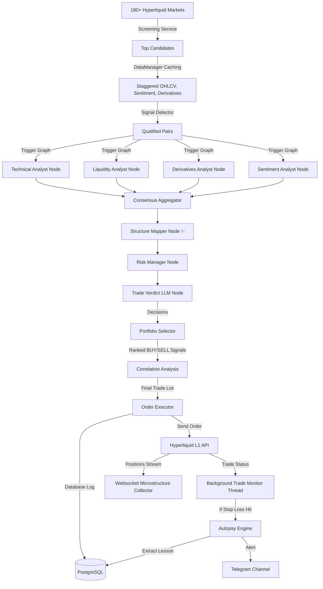

# Dyadix Bot — Project Analysis Report 🤖

Dyadix is an advanced autonomous, multi-agent AI-driven crypto trading system built with **LangGraph** and integrated with the **Hyperliquid L1 Perpetual DEX**. This report presents a comprehensive breakdown of the project architecture, database schema, multi-agent state machines, and operational mechanisms, as well as an analysis of resolved and outstanding issues from the project's development log.

---

## 🏗️ 1. High-Level Architecture & Lifecycle

Dyadix operates on a continuous, event-driven, and rule-filtered loop (continuous mode via [main.py](file:///d:/Project/Python/Bot/dyadix/main.py)) or as a diagnostic single run (one-shot mode).



### Main Operations Lifecycle
1. **Screening & Pre-filtering**: To optimize token costs and reduce latency, the [ScreeningService](file:///d:/Project/Python/Bot/dyadix/service/market/screening/screening_service.py) ranks the top 10 candidates from all Hyperliquid markets using 24h volume, ATR, Open Interest (OI) changes, and funding rates.
2. **Signal Detection**: A fast, deterministic [SignalDetector](file:///d:/Project/Python/Bot/dyadix/pipelines/signal_detector.py) pre-filters these candidates. Only pairs passing the technical/sentiment confluence threshold are passed to the LangGraph workflow.
3. **Graph Analysis (LangGraph)**: The multi-agent workflow runs on the qualified pairs to produce an institutional-grade structured decision (`BUY`, `SELL`, `HOLD`, or `WAIT`).
4. **Portfolio Selector & Correlation Filter**: BUY/SELL verdicts are ranked by confidence. Correlation analysis discards highly correlated pairs (pairwise `|corr| > 0.7`) to prevent over-exposure.
5. **Execution**: Selected trades are dispatched by the [OrderExecutor](file:///d:/Project/Python/Bot/dyadix/service/trade/order_executor.py) to the exchange, along with corresponding Stop Loss (SL) and Take Profit (TP) orders.
6. **Trade Monitoring & Autopsy**: The [TradeMonitor](file:///d:/Project/Python/Bot/dyadix/service/trade/trade_monitor.py) thread syncs the trade state. If a trade hits SL, the [AutopsyEngine](file:///d:/Project/Python/Bot/dyadix/service/trade/autopsy_engine.py) triggers an LLM review of the market state during the trade to extract lessons learned.

---

## ⚙️ 2. Detailed Component Overview

### A. The Orchestration Layer
*   **[main.py](file:///d:/Project/Python/Bot/dyadix/main.py)**: Command-line interface offering loop mode (`python main.py`) and one-shot evaluation (`python main.py --once --pair SOLUSDC`).
*   **[loop_scheduler.py](file:///d:/Project/Python/Bot/dyadix/pipelines/loop_scheduler.py)**: Orchestrates the main loop on a 30s-60s tick interval. Controls background components (TradeMonitor, Microstructure Collector, and Telegram Pollers) and checks global daily limits.
*   **[data_manager.py](file:///d:/Project/Python/Bot/dyadix/pipelines/data_manager.py)**: Serves as a staggered caching layer to prevent API rate limits:
    *   *M3 & M5 OHLCV*: Refreshed every 60s.
    *   *M15 OHLCV*: Refreshed every 90s.
    *   *H1 OHLCV*: Refreshed every 3 minutes.
    *   *Daily OHLCV*: Refreshed every hour.
    *   *Funding Rate / Open Interest / Correlation*: Refreshed every 60s - 120s.
    *   *Sentiment*: Refreshed every 15 minutes.

### B. The LangGraph Multi-Agent Brain
Built in [trading_workflow.py](file:///d:/Project/Python/Bot/dyadix/workflows/trading_workflow.py), the graph maps out analytical responsibilities across parallel rule-based nodes and coordinator nodes:

1.  **Parallel Analyst Nodes** (`Rule-Based`):
    *   **[Technical Analyst Node](file:///d:/Project/Python/Bot/dyadix/workflows/nodes/technical_analyst.py)**: Checks EMA trend regimes, RSI momentum, candlestick confirmations (engulfing/hammer), and **SMC Order Blocks** (adjusts bias and adds +0.20 confidence if price is within a 0.2% threshold of active unmitigated Bullish/Bearish OBs).
    *   **[Liquidity Analyst Node](file:///d:/Project/Python/Bot/dyadix/workflows/nodes/liquidity_analyst.py)**: Tracks sweep alerts (PDH/PDL sweeps), key order book pools, and **WebSocket Microstructure Data** (confluence from CVD 5m/15m alignment, top-5 orderbook imbalance, whale execution buys/sells, and liquidation squeezes to dynamically adapt bias and confidence).
    *   **[Derivatives Analyst Node](file:///d:/Project/Python/Bot/dyadix/workflows/nodes/derivatives_analyst.py)**: Analyzes funding rate trend shifts and Open Interest (OI) positioning.
    *   **[Sentiment Analyst Node](file:///d:/Project/Python/Bot/dyadix/workflows/nodes/sentiment_analyst.py)**: Compiles Fear & Greed index, economic events, and global narratives.
2.  **Consolidation Nodes**:
    *   **[Agent Aggregator Node](file:///d:/Project/Python/Bot/dyadix/workflows/nodes/agent_aggregator.py)**: Runs a dynamic weighted consensus based on `MarketRegime`. Implements **Core-Secondary Veto Logic** where *Liquidity* and *Derivatives* (Core) anchor the final consensus bias if they agree on direction, whereas *Technical* (Secondary) can only modify/penalize confidence by -0.15 if it disagrees. A trade is vetoed (Neutral/WAIT) only if *Liquidity* and *Derivatives* have opposing signals with high confidence ($> 0.70$).
    *   **[Structure Mapper Node](file:///d:/Project/Python/Bot/dyadix/workflows/nodes/structure_mapper.py)** *(New)*: Bridges the gap between directional consensus and precise order placement. Reads raw `market_data` (Order Blocks) and `liquidity_data` (Pools, PDH/PDL, recent sweeps) directly from state — bypassing verdict summaries — to build a `structure_map`. It selects the SL at the nearest valid structural level (Bearish/Bullish OB top/bottom or Strong Pool) with a 0.12% buffer, then runs a **cascade TP algorithm**: iterating from the nearest eligible TP level outward until a level achieves R:R ≥ 1.5. Levels recently swept are penalized (require R:R ≥ 2.0); Moderate pools (< 3 touches) are skipped entirely. If no valid TP is found across all candidates, the node returns `should_wait=True`.
    *   **[Risk Manager Node](file:///d:/Project/Python/Bot/dyadix/workflows/nodes/risk_manager.py)**: Consumes `structure_map` from the Structure Mapper (Path 1 — structure-based). Validates that the natural R:R ≥ 1.5 and that SL distance ≤ 3× ATR, then sets `cleared=True`. Falls back to ATR-based calculation (Path 2) if the Structure Mapper returned no valid setup, but forces `cleared=False` in fallback to prefer WAIT over unstructured trades.
3.  **Verdict Node**:
    *   **[Trade Verdict Node](file:///d:/Project/Python/Bot/dyadix/workflows/nodes/trade_verdict.py)**: Ingests the aggregate metrics. If cleared, it calls the **Decision LLM** (Gemini, Groq, DeepSeek, or 9Router) enforcing a structured JSON output with precise order instructions. **`structure_map`** (SL/TP type, level, cascade log) and **WebSocket Microstructure Data** are both passed inside `context_to_send`, giving the LLM full structural rationale to justify `invalidated_if` and `key_risks`.

### C. Execution & Monitoring Services
*   **[hyperliquid_client.py](file:///d:/Project/Python/Bot/dyadix/service/exchange/hyperliquid_client.py)**: Handles direct EVM transactions to the L1 DEX, supports delegated Agent Wallet authority, USDC balance inquiries, leverage settings, order placements (LIMIT/MARKET), and TP/SL trigger orders.
*   **[hyperliquid_microstructure.py](file:///d:/Project/Python/Bot/dyadix/service/market/hyperliquid/hyperliquid_microstructure.py)**: A standalone websocket engine that aggregates trades, L2 orderbook imbalance (top 5 bids/asks), and liquidations into Cumulative Volume Delta (CVD) statistics.
*   **[trade_monitor.py](file:///d:/Project/Python/Bot/dyadix/service/trade/trade_monitor.py)**: Continuously checks running positions and order status. If TP/SL orders execute or the position closes, it calculates the realized P&L, commits status changes to the DB, and sends Telegram alerts.

---

## 🗄️ 3. Database Schema (PostgreSQL)

Dyadix uses PostgreSQL for persistent ledger tracking. The schema is defined in [models.py](file:///d:/Project/Python/Bot/dyadix/data/models.py):

### `sentiments` Table
Stores LLM global sentiment analysis runs.
*   `id` (UUID): Primary key.
*   `timestamp` (DateTime): UTC time of analysis.
*   `overall_sentiment` (String): e.g., `"Strong Bullish"`, `"Neutral"`.
*   `sentiment_score` (Float): 0 to 100 scale.
*   `confidence` (Float): 0.0 to 1.0.
*   `dominant_narrative`, `news_impact`, `social_mood`, `trading_implication` (Text).
*   `key_insights` (JSONB): Bullet points of insights.
*   `raw_data` (JSONB): Raw LLM response payload.

### `decisions` Table
Records every LLM coordinate recommendation generated.
*   `id` (UUID): Primary key.
*   `pair` (String): e.g., `"BTCUSDC"`.
*   `timestamp` (DateTime): UTC time of decision.
*   `decision` (String): `"BUY"`, `"SELL"`, `"HOLD"`, or `"WAIT"`.
*   `confidence` (Float): 0.0 to 1.0.
*   `bias` (String): e.g., `"Strong Bullish"`.
*   `entry_zone` (String), `entry_price_calc` (Float): Planned midpoint.
*   `stop_loss` (Float), `target` (Float): Boundary coordinates.
*   `risk_reward` (String): Target ratio (e.g. `"1:3.0"`).
*   `execution_type` (String): `"MARKET"` or `"LIMIT"`.
*   `recommended_timeframe` (String), `reason` (Text).
*   `llm_context` (JSONB): Fully archived context sent to the LLM.

### `trades` Table
Main ledger tracking position lifecycle and autopsy outcomes.
*   `id` (UUID): Primary key.
*   `decision_id` (UUID): Foreign key referencing `decisions(id)`.
*   `pair` (String): e.g., `"BTCUSDC"`.
*   `exchange_order_id` (String): Hyperliquid Order ID.
*   `side` (String): `"BUY"` or `"SELL"`.
*   `status` (String): `"RUNNING"`, `"CLOSED_TP"`, `"CLOSED_SL"`, `"CANCELED"`, or `"PENDING"`.
*   `entry_price` (Float), `entry_price_planned` (Float).
*   `stop_loss_price` (Float), `target_price` (Float).
*   `quantity` (Float), `leverage` (Integer).
*   `stop_loss_order_id` (String), `take_profit_order_id` (String).
*   `exit_price` (Float), `realized_pnl` (Float), `exit_reason` (String).
*   `autopsy_analysis` (Text): Post-mortem market context.
*   `autopsy_lesson` (Text): Extracted rule logic to avoid future SL hits.
*   `opened_at` (DateTime), `closed_at` (DateTime).

---

## 🔍 4. Key Developer Issue Diagnoses (`problem.md`)

Below is the analysis of issues recorded in [problem.md](file:///d:/Project/Python/Bot/dyadix/problem.md):

### 1. Missing Candle Context (15/04/2026) - **RESOLVED**
*   *Symptom*: LLM was making decisions without context on the most recent candles.
*   *Solution*: The main pipeline now calls `_inject_candle_summary()` (using [CandleSummaryEngine](file:///d:/Project/Python/Bot/dyadix/features/candle/candles_summary.py)) and `_inject_market_snapshot()`. This appends the OHLCV summary text and indicators for the last 10 candles directly to the LLM prompt context.

### 2. Mismatched Timeframes & Minor Pairs (16/04/2026) - **RESOLVED**
*   *Symptom*: Minor pairs or illiquid assets behave poorly on low timeframes (M5/M15).
*   *Solution*: Implemented dynamic trading modes in [settings.yml](file:///d:/Project/Python/Bot/dyadix/config/settings.yml). Scalping runs on fast timeframes (`3m`, `5m`, `15m`, `1h`), whereas swing mode runs on standard timeframes (`15m`, `1h`, `4h`, `1d`). This adjusts limits, indicators, and ATR-based stops per mode.

### 3. Rapid Counter-Trading Signals (18/04/2026) - **RESOLVED**
*   *Symptom*: LLM recommended counter trades (BUY, then SELL 5 minutes later) causing high slippage and commission fees.
*   *Solution*: Added a strict cooldown tracking feature inside `DecisionLogger`. By default, after calling the Decision LLM for a pair, a `cooldown_seconds` (e.g., 1200 seconds / 20 minutes) is enforced. Any signal detected on that pair within this window is skipped.

### 4. Loop Hangs When a Position is Active (26/04/2026) - **CRITICAL DIAGNOSIS**
*   *Symptom*: "Setelah ada pair yang running, looping tidak berjalan, stuck menunggu hasil dari pair yang running itu selesai, baru looping dilanjutkan."
*   *Cause Identified*: 
    In [loop_scheduler.py](file:///d:/Project/Python/Bot/dyadix/pipelines/loop_scheduler.py#L187-L199):
    ```python
    # ── Step 0.5: Check Daily Limits ──────────────────────────────
    try:
        from service.trade.trade_guard import TradeGuard
        is_limit_reached, limit_reason = TradeGuard.is_daily_limit_reached()
        if is_limit_reached:
            logger.info(f"⏳ Daily limit reached: {limit_reason}. Sleeping...")
            return
            
        if TradeGuard.is_max_positions_reached():
            logger.info("⏳ Max concurrent positions reached. Sleeping...")
            return
    except Exception as e:
        logger.warning(f"Failed to check daily limits or max positions: {e}")
    ```
    If `max_positions` is set to `1` in `settings.yml`, and 1 trade opens:
    `TradeGuard.is_max_positions_reached()` evaluates to `True` (since 1 >= 1).
    Consequently, `_run_cycle` returns immediately. The scheduler sleeps for the full `tick_interval` (60s) and repeats, skipping data fetching, screening, and logic for the other 4 pairs entirely!
    *Recommended Fix*: Change `is_max_positions_reached` so that it does not abort the entire cycle. Instead, let it log a warning and set a flag (e.g., `execution_blocked = True`). The bot should still run the data pipelines and screen candidates, but bypass order placement in `OrderExecutor` while logging: "Signal detected but order execution is blocked because max concurrent positions are active."

---

## 📈 5. Conclusion & Action Plan

Dyadix is a highly modular system that divides its workflow into rule-based analysis (speed and safety) and LLM reasoning (complex strategy synthesis). The recent addition of the **Structure Mapper Node** marks a paradigm shift from *direction-first* trading (vote on bias → calculate SL/TP mathematically) to *level-first* trading (identify structural levels first → derive SL/TP organically → evaluate R:R).

The remaining core optimizations include:
1.  **Refining Loop Blockers**: Modify [loop_scheduler.py](file:///d:/Project/Python/Bot/dyadix/pipelines/loop_scheduler.py) to decouple position count checks from market scanning, keeping the system active and responsive.
2.  **Deeper News Parsing**: Moving beyond RSS title feeds to a structured scraper that extracts the full content of articles before presenting summaries to the LLM.
3.  **H4 Sweep History** *(Future)*: Currently, the Structure Mapper can only detect sweeps within the last 8–10 candles of the active timeframe. Adding H4 OHLCV data to `market_data` would enable detection of sweeps from the past ~7 days, improving the accuracy of the TP sweep-deduction rule.
