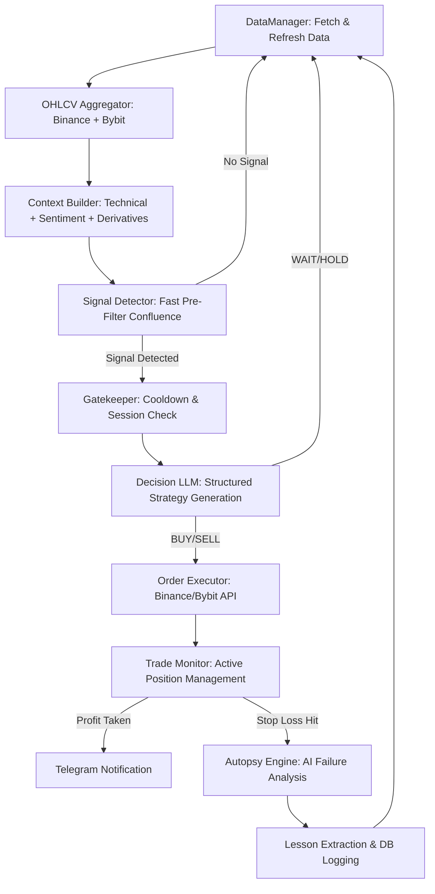

# Dyadix 🤖

<div align="center">

**An Advanced Autonomous AI-Driven Crypto Trading System with Multi-Layer Market Intelligence**


</div>

---

## 📌 Overview

**Dyadix** is a high-frequency (intraday) autonomous cryptocurrency trading system that combines multi-layered market analysis with Large Language Models (LLM) to make and execute professional-grade trading decisions. 

Unlike traditional rule-based bots, Dyadix acts as an **AI-driven hedge fund manager**, analyzing everything from technical indicators and derivative flows to global news sentiment and social media narratives before executing trades on Binance or Bybit.

### Core Philosophy

> *"Capital preservation is priority number one. Only trade when probability is clearly in your favor, and learn from every loss through deep analysis."*

Dyadix specializes in intraday trading during the London-NY session overlap, leveraging volatility and liquidity to capture high-probability moves.

---

## 🏗️ Architecture & Lifecycle

Dyadix operates in a continuous loop (Loop Mode) or a diagnostic single-run mode (One-shot).



---

## 🎯 Key Features

### 1. Robust Data Aggregation & Fallback
- **Dual-Exchange Sync**: Aggregates OHLCV from **Binance Futures** and **Bybit Futures** (Volume-Weighted).
- **Smart Fallback**: Automatically falls back to a primary exchange (Binance) if data mismatch or exchange downtime is detected, ensuring 24/7 uptime.

### 2. Multi-Layer Sentiment Engine
- **News Aggregator**: Scrapes RSS feeds from Yahoo Finance, Cointelegraph, Decrypt, etc.
- **Social Pulse**: Analyzes Twitter/X influencers and Reddit (r/cryptocurrency) sentiment.
- **Economic Overlay**: Real-time economic calendar tracking (FED meetings, CPI data, etc.).
- **Fear & Greed**: Real-time crowd psychology tracking.

### 3. Advanced Feature Engineering
- **Technical Analysis**: Trend regimes (H1), RSI/Momentum, ATR-based Volatility, and Daily Bias detection.
- **Derivative Flows**: Funding Rate and Open Interest (OI) change analysis.
- **Liquidity Detection**: Swing pool identification and Sweep/Fakeout detection logic.
- **Correlation Engine**: Return-based inter-asset correlation to prevent over-exposure.

### 4. AI-Powered "Brain" (Multi-LLM)
- **News Specialist**: Compresses thousands of headlines into high-impact narratives.
- **Candle Narrator**: Translates raw OHLCV arrays into human-readable price action summaries to save tokens.
- **Master Decision LLM**: Combines all contexts to produce structured JSON plans (Entry, SL, TP, RR).

### 5. Automated Execution & Autopsy
- **Execution**: Automated BUY/SELL orders with precision entry zones.
- **Trade Guard**: Prevents "over-trading" or opening multiple positions for the same pair.
- **Autopsy Engine**: A unique post-trade analysis feature. If a trade hits Stop Loss, an LLM analyzes the market context at the time of failure to extract **Lessons Learned** and improve future accuracy.

### 6. Interactive Telegram Control
- **Full Remote Control**: Start, stop, or pause the bot via Telegram commands.
- **Real-time Status**: Request 24h performance summaries, current cycle status, or running trade details.
- **Detailed Alerts**: Rich-text notifications for signal detections, order placements, and trade exits.

---

## 📁 Project Structure

```
dyadix/
├── bot/                  # Telegram bot controller & notifications
├── config/               # settings.yml and YAML loader
├── data/                 # PostgreSQL Models & Database init
├── features/             # Core engines: technical, sentiment, liquidity, etc.
├── llm/                  # Multi-provider client factory (Gemini, Groq, DeepSeek)
├── pipelines/            # Loop Scheduler & Main Pipeline orchestrator
├── service/              
│   ├── market/           # Exchange API connectors (Binance, Bybit)
│   └── trade/            # Order Executor, Trade Monitor, Autopsy Engine
├── utils/                # OHLCV Aggregator & Session Checkers
└── main.py               # Entry Point
```

---

## 🚀 Quick Start

### Docker (Recommended)
The easiest way to run Dyadix is using Docker Compose.

1. **Configure Environment**:
   ```bash
   cp .env.example .env
   # Fill in your API keys (Binance, Bybit, LLM API Key, Telegram)
   ```
2. **Start the Bot**:
   ```bash
   docker-compose up --build -d
   ```

### Manual Installation
1. **Setup**:
   ```bash
   python -m venv .venv
   source .venv/bin/activate
   pip install -r requirements.txt
   ```
2. **Run**:
   - **Continuous Mode**: `python main.py`
   - **One-Shot Analysis**: `python main.py --once`

---

## 🤖 Telegram Commands

- `/start` : Force start the bot (ignores active session hours).
- `/stop`  : Pause all trading activity.
- `/auto`  : Resume automatic mode (follows session hours).
- `/status`: Get current cycle, uptime, and daily PnL summary.
- `/trades`: Show all currently open positions.

---

## ⚠️ Risk Disclosure

> **DYADIX IS FOR RESEARCH PURPOSES ONLY.**
> Cryptocurrency trading involves significant risk. LLMs can hallucinate. This system is designed for experienced users who understand algorithmic trading. Never trade with capital you cannot afford to lose.

---

<div align="center">

**Made with ❤️ by the Dyadix Team**

*Last Updated: May 2, 2026*

</div>